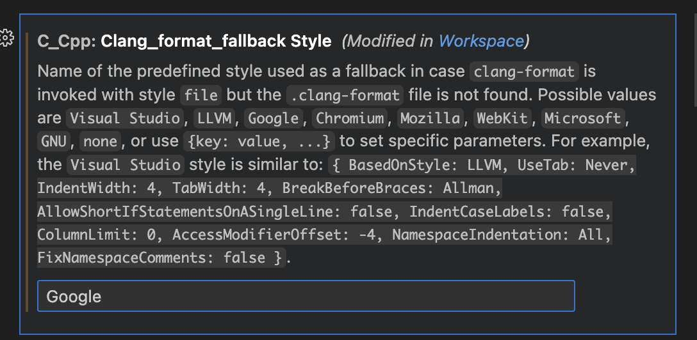
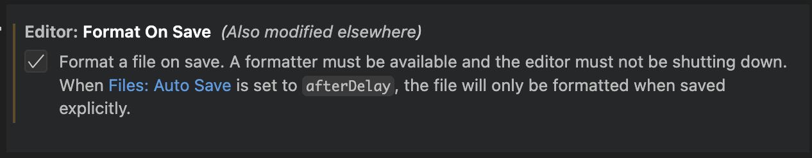

# Семинар 01

## 🔧 Настройка окружения для C++

Чтобы писать и запускать программы на C++, нужно:

1. Рабочая ОС (Linux как основная или вторая рядом с Windows или же MacOS).
2. IDE для удобной разработки (рекомендую Visual Studio, но есть альтернативы типа Clion).
3. Компилятор (через пакетный менеджер).

---

### 1. Установка Linux второй системой (dual-boot)

Linux — удобная система для разработки: все компиляторы, библиотеки и утилиты доступны сразу.

[Пошаговая инструкция](https://ubuntu.com/tutorials/install-ubuntu-desktop#1-overview)

#### Шаги:

1. Скачайте образ **Ubuntu** (или другой дистрибутив) с [официального сайта](https://ubuntu.com/download/desktop).
2. Запишите ISO-образ на флешку с помощью [Rufus](https://rufus.ie/) или [balenaEtcher](https://etcher.balena.io)
3. Перезагрузите компьютер, зайдите в system boot menu (обычно клавишами F2, F12) и выберите загрузку с флешки.
4. В установщике выберите **Install Ubuntu alongside Windows** (установка рядом с Windows).
5. Выберите размер раздела (обычно 20–50 ГБ достаточно).
6. После установки при старте компьютера появится меню выбора ОС.

---

### 2. Visual Studio (Windows, основной вариант IDE)

Если хотите работать в Windows — ставьте **Visual Studio Community**.

1. Скачайте [Visual Studio Community](https://visualstudio.microsoft.com/vs/community/).
2. При установке выберите **Desktop development with C++**.
3. Создайте проект: File → New → Project → Console App (C++).

> ⚡ В комплекте идёт компилятор **MSVC**, отдельно ставить ничего не нужно.

---

### 3. Альтернативы (по желанию)

* **CLion** (бесплатен для студентов, мощная IDE).
* **VS Code** (лёгкий редактор, но нужно настроить плагины для C++).
* **Qt Creator** или **Sublime Text** (минимализм).

⚠️ Подробной документации по ним в курсе не будет.

---

### 4. Компилятор и проверка

* В Linux: используем **g++** (часть `build-essential`).
* В MacOS: используем **clang++** (часть `llvm`) или тоже g++.

### Установка

В Linux откройте терминал и установите компилятор:

```bash
sudo apt update
sudo apt install g++ build-essential
```

Проверка:

```bash
g++ --version
```

В MacOS:

- Установка [homebrew](https://brew.sh/ru/)
- Установка компиляторов 

```bash
brew install gcc

или

xcode-select --install (для clang)
```


# Настройка VSCode 

Если дебагер автоматически не сгенерировал, нужно создать директорию `.vscode` и в ней файл `tasks.json`

```
{
    "tasks": [
        {
            "type": "cppbuild",
            "label": "C/C++: g++ build active file",
            "command": "/usr/bin/g++", <- путь к компилятору
            "args": [
                "-fdiagnostics-color=always",
                "-g",
                "${file}",
                "-o",
                "${fileDirname}/${fileBasenameNoExtension}"
            ],
            "options": {
                "cwd": "${fileDirname}"
            },
            "problemMatcher": [
                "$gcc"
            ],
            "group": {
                "kind": "build",
                "isDefault": true
            },
            "detail": "Task generated by Debugger."
        }
    ],
    "version": "2.0.0"
}
```
примерно с таким содержимым. 

Для настройки форматирования найдите этот параметр в настройках и напишите `Google` 


и еще format on save лучше включить 


---
Простейший тест: создаём `main.cpp`

```cpp
#include <iostream>

int main() {
  std::cout << "Hello world\n";
  return 0;
}
```

Компиляция руками:

```bash
g++ main.cpp -o hello
./hello
```

Если увидели `Hello, world`, значит всё работает 🎉

